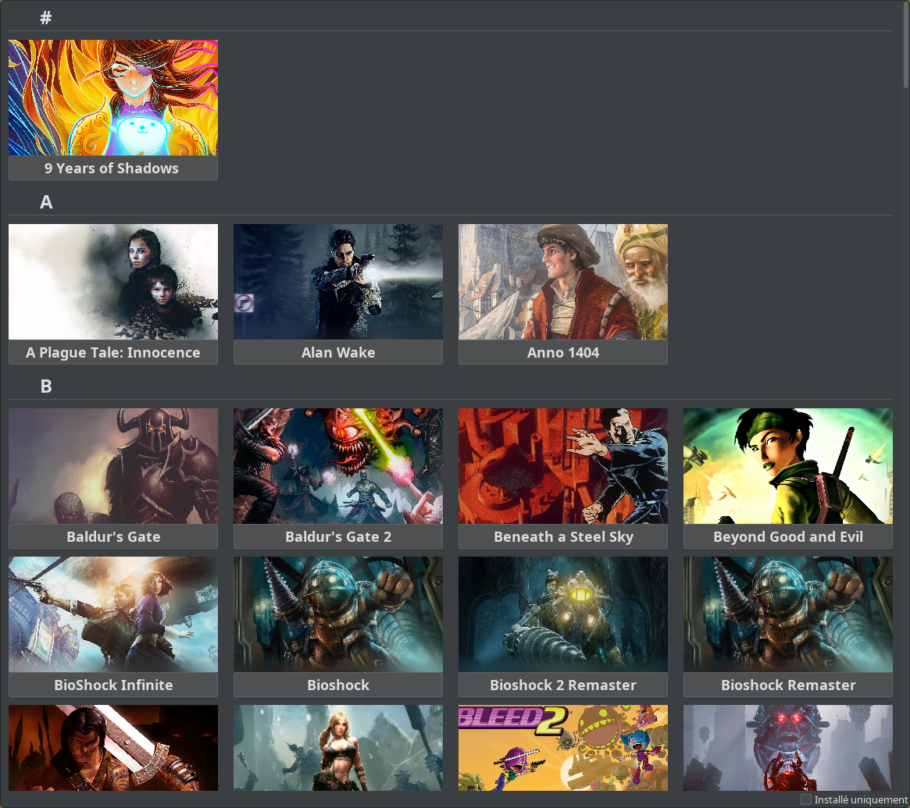
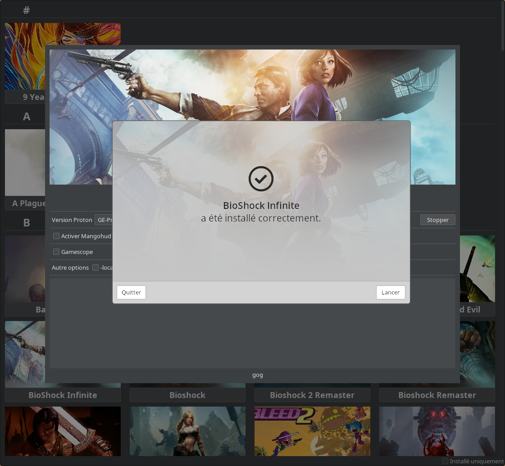
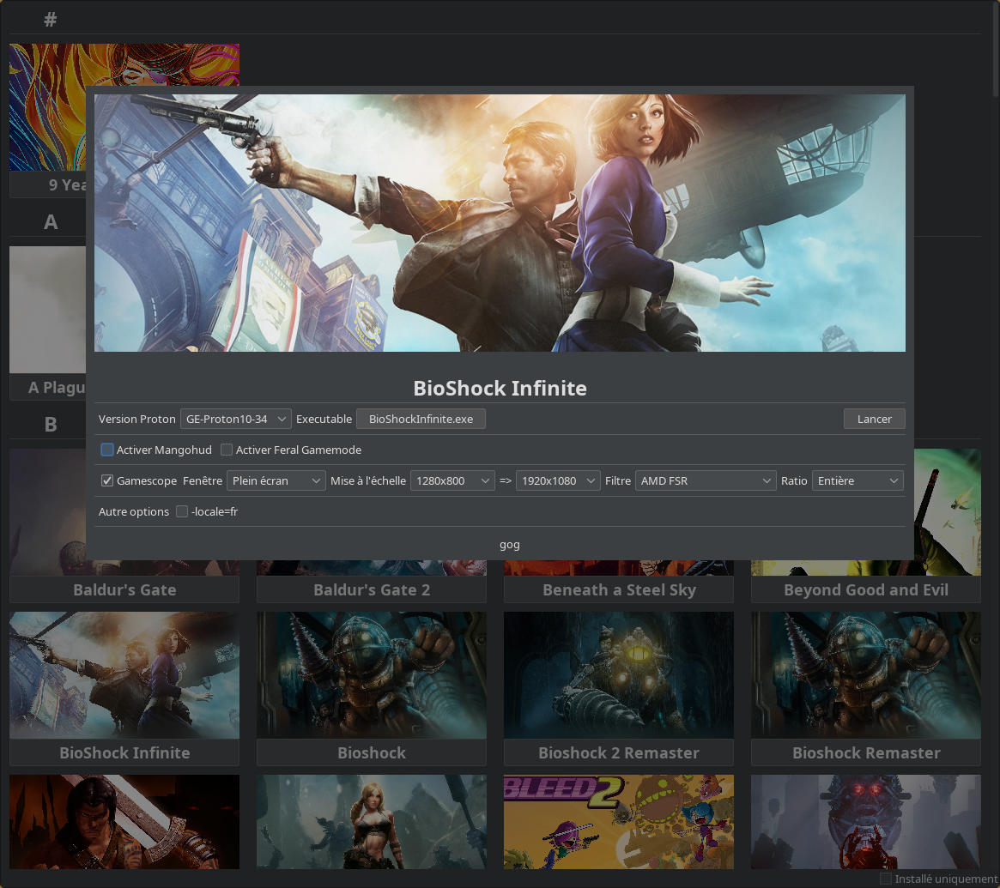

# GameLauncher

Ce projet permet d'installer et de lancer des jeux windows depuis le backup des installeurs fourni par GoG. Ce projet fonctionne grâce à umu. 
Il est conseillé également d'avoir steam d'installer.

# Configuration

## Fichier d'installation

Dans mon cas les executable d'installation sont sur mon NAS. 
Il faut que les jeux soit organisé sur ce format : 

~~~
/<configuration.propertie:folder.instalers>
|--A
|  |--Alan Wake
|  |  |-- setup<...>.exe et setup<...>.bin d'installation
|  |  |-- un .jpg
|  |  |-- umu-<gameid>.gameid pour les protonfixe [umu-database](https://github.com/Open-Wine-Components/umu-database) et [umu-protonfixes](https://github.com/Open-Wine-Components/umu-protonfixes)
|  |  |-- gog.store
|
~~~

# Truc de dev pour note

steam steam://install/4183110
steam steam://install/1628350
steam steam://install/1391110
steam steam://install/1070560

https://www.gaminglinux.fr/wine-proton-et-umu-executer-des-jeux-windows-sur-linux/

https://github.com/Open-Wine-Components/umu-launcher/blob/main/docs/umu.1.scd

à backuper : 
- /home/shionn/.local/share/umu/steamrt3
- /home/shionn/.cache/winetricks/

